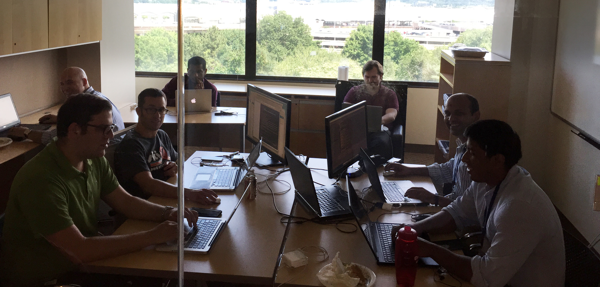

[<-- Back to the Evidence Listing](https://github.com/itgfirm/safe-food/edit/master/Evidence)  &nbsp;&nbsp;&nbsp;&nbsp;&nbsp;&nbsp;&nbsp;&nbsp;&nbsp;&nbsp;&nbsp;&nbsp;&nbsp;&nbsp;&nbsp;&nbsp;&nbsp;&nbsp;&nbsp;&nbsp;&nbsp;&nbsp;&nbsp;&nbsp;&nbsp;&nbsp;&nbsp;&nbsp;&nbsp;&nbsp;&nbsp;&nbsp;&nbsp;&nbsp;&nbsp;&nbsp;&nbsp;&nbsp;&nbsp;&nbsp;&nbsp;&nbsp;&nbsp;&nbsp;&nbsp;&nbsp;&nbsp;&nbsp;&nbsp;&nbsp;&nbsp;&nbsp;&nbsp;&nbsp;&nbsp;&nbsp;&nbsp;&nbsp;&nbsp;&nbsp;&nbsp;&nbsp;&nbsp;&nbsp;&nbsp;&nbsp;&nbsp;&nbsp;&nbsp;&nbsp;&nbsp;&nbsp;&nbsp;&nbsp;&nbsp;&nbsp;&nbsp;&nbsp;&nbsp;&nbsp;&nbsp;&nbsp;&nbsp;&nbsp;&nbsp;&nbsp;&nbsp;&nbsp;&nbsp;&nbsp;&nbsp;&nbsp;&nbsp;&nbsp;&nbsp;&nbsp;&nbsp;&nbsp;&nbsp;&nbsp;&nbsp;&nbsp;[Next Evidence (c) -->](https://github.com/itgfirm/safe-food/edit/master/Evidence/c)

***b. assembled a multidisciplinary and collaborative team that includes at a minimum two of the labor categories limited to the Development Pool labor categories to develop the prototype as quoted in Attachment C. The quoter’s proposed mix of labor categories and level of effort for its working prototype, as reflected in Attachment C, shall be evaluated to assess the quoter’s understanding and capability to supply agile delivery services***

## The Team

Based on the requirements of the pilot effort (modern web stack), we decided that we needed to include some of our top talent, who already have concrete experience working with and deploying applications utilizing the technologies we chose: including Node.js and Angular, and leveraging the best practices of Agile, Test Driven Development, and DevOps.  

To fulfill these needs, we constructed the following team:

| Pool 2 Labor Category | Name | Responsibilities |
|---|---|---|
| Category 2 - Technical Architect | Sudha Venkateswaran | Product Owner |
| Category 2 - Technical Architect | Casey Johnson | Scrum Master |
| Category 2 - Technical Architect | Phillip Armour | Technical Architect |
| Category 6 - Front End Web Developer | Mohammed Nauage | Javascript Developer |
| Category 7 - Backend Web Developer | Hitesh Patel | Javascript Developer |
| Category 6 - Front End Web Developer | Brian Johnston | Javascript Developer |
| Category 6 - Front End Web Developer | Tito Araujo | UX Design & Graphics |
| Category 8 - DevOps Engineer | Ben Rose | DevOps Engineer |
| Category 6 - Front End Web Developer | Kevin Foglio | Test Specialist |
| Category 2 - Technical Architect | Kent Bridges | Security Architect |

### Project Charter
The members of the team are documented in the project charter

[ Safe Food Project Charter](https://github.com/itgfirm/safe-food/blob/master/Evidence/a/ProjectCharter.docx)

### Github Contributors
Each member of the dev team can be seen committing to the GitHub repository via the project's Contributors page:

### JIRA Members
All team members have access to JIRA (our Agile Project Management tool). The Project Owner and Scrum Master collaborated to create and prioritize Stories in the backlog. The development team members were responsible for estimating and updating their assigned stories.

### Slack Members
All team members utilized Slack to both stay abreast of the project (including automated processes) as well as to communicate with other team members.

### Additional Collaboration

We also relied on inputs from a handful of other “stakeholders” who represented the interests of an imagined government business owner as well as focus group members representing the general public (end users).

[<-- Back to the Evidence Listing](https://github.com/itgfirm/safe-food/edit/master/Evidence)  &nbsp;&nbsp;&nbsp;&nbsp;&nbsp;&nbsp;&nbsp;&nbsp;&nbsp;&nbsp;&nbsp;&nbsp;&nbsp;&nbsp;&nbsp;&nbsp;&nbsp;&nbsp;&nbsp;&nbsp;&nbsp;&nbsp;&nbsp;&nbsp;&nbsp;&nbsp;&nbsp;&nbsp;&nbsp;&nbsp;&nbsp;&nbsp;&nbsp;&nbsp;&nbsp;&nbsp;&nbsp;&nbsp;&nbsp;&nbsp;&nbsp;&nbsp;&nbsp;&nbsp;&nbsp;&nbsp;&nbsp;&nbsp;&nbsp;&nbsp;&nbsp;&nbsp;&nbsp;&nbsp;&nbsp;&nbsp;&nbsp;&nbsp;&nbsp;&nbsp;&nbsp;&nbsp;&nbsp;&nbsp;&nbsp;&nbsp;&nbsp;&nbsp;&nbsp;&nbsp;&nbsp;&nbsp;&nbsp;&nbsp;&nbsp;&nbsp;&nbsp;&nbsp;&nbsp;&nbsp;&nbsp;&nbsp;&nbsp;&nbsp;&nbsp;&nbsp;&nbsp;&nbsp;&nbsp;&nbsp;&nbsp;&nbsp;&nbsp;&nbsp;&nbsp;&nbsp;&nbsp;&nbsp;&nbsp;&nbsp;&nbsp;&nbsp;[Next Evidence (c) -->](https://github.com/itgfirm/safe-food/edit/master/Evidence/c)
