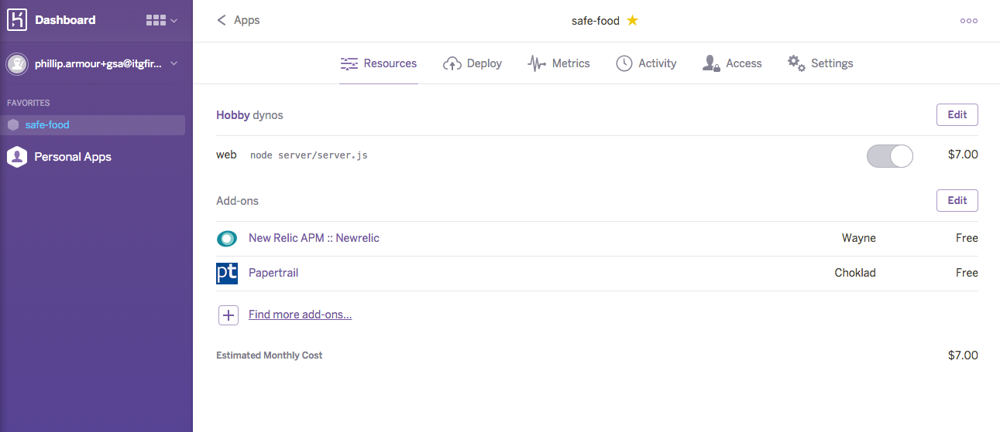
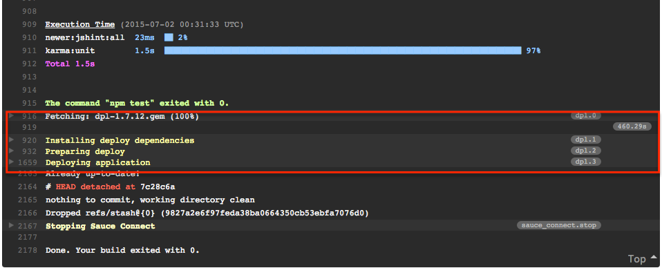
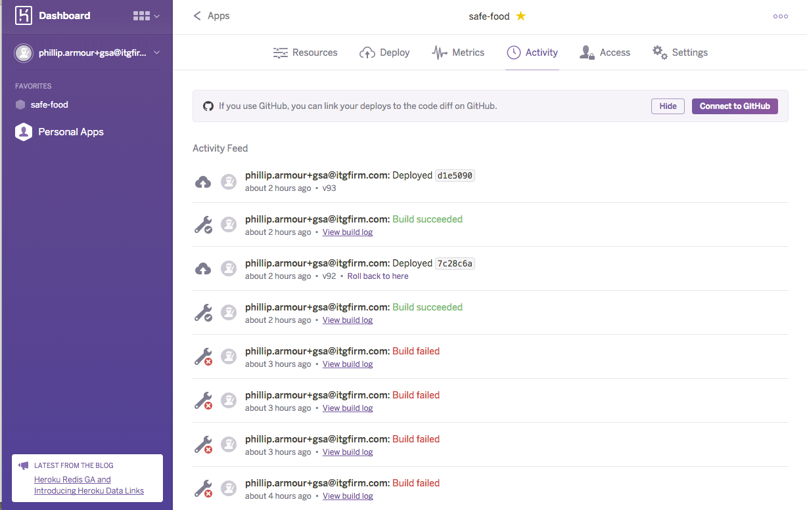

[<-- Back to the Evidence Listing](https://github.com/itgfirm/safe-food/edit/master/Evidence)  &nbsp;&nbsp;&nbsp;&nbsp;&nbsp;&nbsp;&nbsp;&nbsp;&nbsp;&nbsp;&nbsp;&nbsp;&nbsp;&nbsp;&nbsp;&nbsp;&nbsp;&nbsp;&nbsp;&nbsp;&nbsp;&nbsp;&nbsp;&nbsp;&nbsp;&nbsp;&nbsp;&nbsp;&nbsp;&nbsp;&nbsp;&nbsp;&nbsp;&nbsp;&nbsp;&nbsp;&nbsp;&nbsp;&nbsp;&nbsp;&nbsp;&nbsp;&nbsp;&nbsp;&nbsp;&nbsp;&nbsp;&nbsp;&nbsp;&nbsp;&nbsp;&nbsp;&nbsp;&nbsp;&nbsp;&nbsp;&nbsp;&nbsp;&nbsp;&nbsp;&nbsp;&nbsp;&nbsp;&nbsp;&nbsp;&nbsp;&nbsp;&nbsp;&nbsp;&nbsp;&nbsp;&nbsp;&nbsp;&nbsp;&nbsp;&nbsp;&nbsp;&nbsp;&nbsp;&nbsp;&nbsp;&nbsp;&nbsp;&nbsp;&nbsp;&nbsp;&nbsp;&nbsp;&nbsp;&nbsp;&nbsp;&nbsp;&nbsp;&nbsp;&nbsp;&nbsp;&nbsp;&nbsp;&nbsp;&nbsp;&nbsp;&nbsp;[Next Evidence (e) -->](https://github.com/itgfirm/safe-food/edit/master/Evidence/e)

***d. deployed the prototype on an Infrastructure as a Service (IaaS) or Platform as a Service (PaaS) provider, and indicated which provider was used***

## Heroku
The Safe Food prototype was deployed on the Heroku Platform as a Service (PaaS). PaaS enables our customers to innovate faster, focus resources, and save money.

Heroku is a market leader in providing Node.JS (as well as other stacks) hosting solutions.  Also, inorder to balance architectural flexibility with hands-off, managed service, ITG believes that Heroku offered the best platform for our pilot application.

### Heroku Platform Dashboard
We chose to deploy the [Safe Food Application](http://safe-food.herokuapp.com) to the Heroku Platform as a Service (PaaS). For this project we need our hosting environment to meet several requirements:

- Full support for Node.js
- Full-service and feature-rich application hosting
- Ability to scale up resource but “pay as you go”
- Abundant community of partners and plugins/integrations
- API access to manage environment provisioning and deploys

### Deploying to Heroku
We tightly integrated the deployment of our application to our build process [via our CI tool (Travis CI)](https://github.com/itgfirm/safe-food/blob/master/.travis.yml). Each build deploys a new instance based on the latest build within the configurations configured within our Heroku account (i.e. server size, scalability, integrations, etc.)

*[Sample of a Full Build Log](TravisCI_Build_Output.txt)

[<-- Back to the Evidence Listing](https://github.com/itgfirm/safe-food/edit/master/Evidence)  &nbsp;&nbsp;&nbsp;&nbsp;&nbsp;&nbsp;&nbsp;&nbsp;&nbsp;&nbsp;&nbsp;&nbsp;&nbsp;&nbsp;&nbsp;&nbsp;&nbsp;&nbsp;&nbsp;&nbsp;&nbsp;&nbsp;&nbsp;&nbsp;&nbsp;&nbsp;&nbsp;&nbsp;&nbsp;&nbsp;&nbsp;&nbsp;&nbsp;&nbsp;&nbsp;&nbsp;&nbsp;&nbsp;&nbsp;&nbsp;&nbsp;&nbsp;&nbsp;&nbsp;&nbsp;&nbsp;&nbsp;&nbsp;&nbsp;&nbsp;&nbsp;&nbsp;&nbsp;&nbsp;&nbsp;&nbsp;&nbsp;&nbsp;&nbsp;&nbsp;&nbsp;&nbsp;&nbsp;&nbsp;&nbsp;&nbsp;&nbsp;&nbsp;&nbsp;&nbsp;&nbsp;&nbsp;&nbsp;&nbsp;&nbsp;&nbsp;&nbsp;&nbsp;&nbsp;&nbsp;&nbsp;&nbsp;&nbsp;&nbsp;&nbsp;&nbsp;&nbsp;&nbsp;&nbsp;&nbsp;&nbsp;&nbsp;&nbsp;&nbsp;&nbsp;&nbsp;&nbsp;&nbsp;&nbsp;&nbsp;&nbsp;&nbsp;[Next Evidence (e) -->](https://github.com/itgfirm/safe-food/edit/master/Evidence/e)
