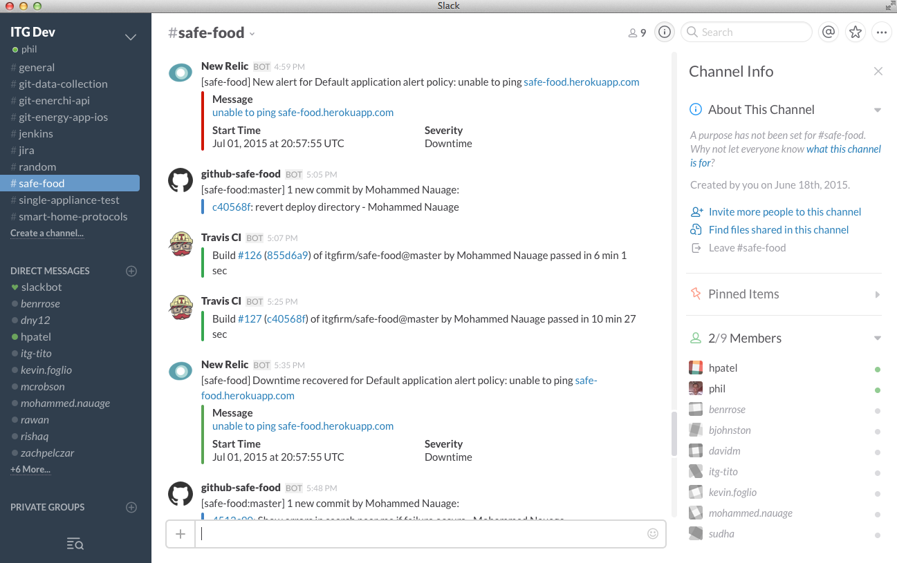
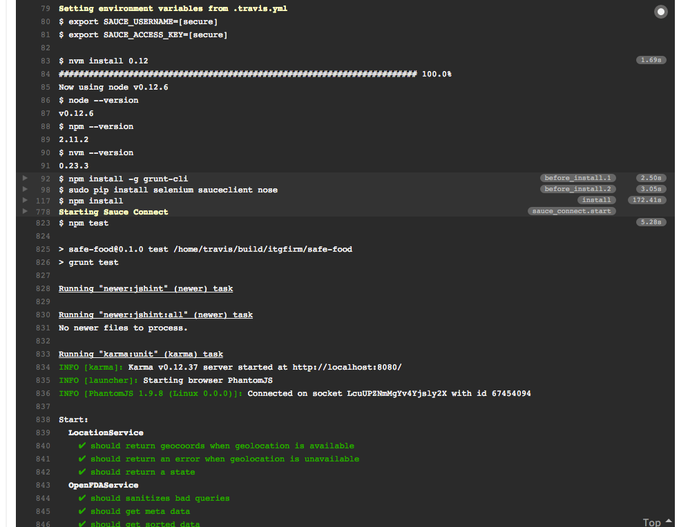
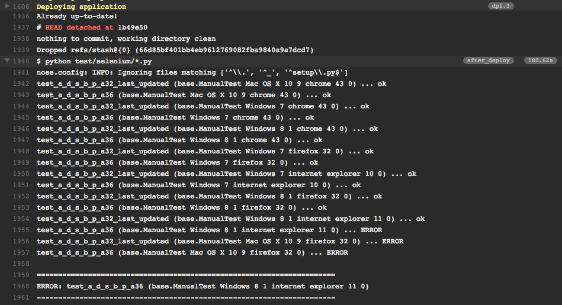
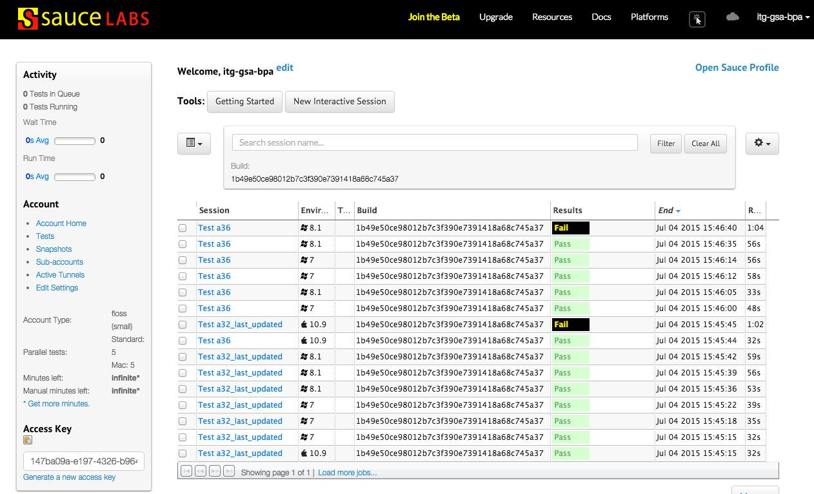

[<-- Back to the Evidence Listing](https://github.com/itgfirm/safe-food/edit/master/Evidence)  &nbsp;&nbsp;&nbsp;&nbsp;&nbsp;&nbsp;&nbsp;&nbsp;&nbsp;&nbsp;&nbsp;&nbsp;&nbsp;&nbsp;&nbsp;&nbsp;&nbsp;&nbsp;&nbsp;&nbsp;&nbsp;&nbsp;&nbsp;&nbsp;&nbsp;&nbsp;&nbsp;&nbsp;&nbsp;&nbsp;&nbsp;&nbsp;&nbsp;&nbsp;&nbsp;&nbsp;&nbsp;&nbsp;&nbsp;&nbsp;&nbsp;&nbsp;&nbsp;&nbsp;&nbsp;&nbsp;&nbsp;&nbsp;&nbsp;&nbsp;&nbsp;&nbsp;&nbsp;&nbsp;&nbsp;&nbsp;&nbsp;&nbsp;&nbsp;&nbsp;&nbsp;&nbsp;&nbsp;&nbsp;&nbsp;&nbsp;&nbsp;&nbsp;&nbsp;&nbsp;&nbsp;&nbsp;&nbsp;&nbsp;&nbsp;&nbsp;&nbsp;&nbsp;&nbsp;&nbsp;&nbsp;&nbsp;&nbsp;&nbsp;&nbsp;&nbsp;&nbsp;&nbsp;&nbsp;&nbsp;&nbsp;&nbsp;&nbsp;&nbsp;&nbsp;&nbsp;&nbsp;&nbsp;&nbsp;&nbsp;&nbsp;&nbsp;[Next Evidence (c) -->](https://github.com/itgfirm/safe-food/edit/master/Evidence/g)

***f. set up or used a continuous integration system to automate the running of tests and continuously deployed their code to their IaaS or PaaS provider***

## Travis CI
We used [Travis CI as our continuous integration (CI) system](https://travis-ci.org/itgfirm/safe-food/builds).  It allowed us to configure [common build and test scripts](https://github.com/itgfirm/safe-food/blob/master/package.json) (via NPM) and ensure that we are [executing them consistently and regularly](https://github.com/itgfirm/safe-food/blob/master/.travis.yml).

### Continuous Integration and Continuous Deployments
We chose to link the CI build to our Master, and only, branch in Github due to fact that we are a small team operating on a tight deadline and would benefit from tighter feedback loops with respect to how our builds are faring in the integration environment. 

We also chose Travis CI due to its multitude of integration partners, including Heroku, SauceLabs, and Slack.  Travis offers a rich feature set for deploying to Heroku environments, and we found it very easy to add continuous deployment to our CI build. Travis CI was especially helpful in providing visibility into the success (or lack of) for each build. Travis CI provides a Build Status badge that can be embeded anywhere like on a GitHub README page:

And similarly it also creates a [publicly available dashboard](https://travis-ci.org/itgfirm/safe-food/builds) with a detailed history of our builds:

Travis also published build notifications to our team's Slack channel:

### Automated Testing

We leveraged NPM, Grunt, and Travis CI to ensure that our test cases are run as often and consistently as possible. The continuous integration build that occurs on every push to the master branch executes all of our unit tests (from Karma and Mocha), but it also runs JSHint and executes our acceptance tests by running our Selenium tests cases.  We use an integration between Travis CI and SauceLabs to execute true end-to-end test cases using a configureable OS and browser.

and

SauceLabs provides a [publicly available dashboard](https://saucelabs.com/u/itg-gsa-bpa) that shows the results of the tests cases for each build.

Another feature of our CI build is that we run cross-browser testing with every build. We are utilizing an integration between Travis CI and SauceLabs to run our end-to-end tests across a number of different operating systems and browsers.  This allows us to have transparency at every build about our ability to reach as many customers as possible.

[<-- Back to the Evidence Listing](https://github.com/itgfirm/safe-food/edit/master/Evidence)  &nbsp;&nbsp;&nbsp;&nbsp;&nbsp;&nbsp;&nbsp;&nbsp;&nbsp;&nbsp;&nbsp;&nbsp;&nbsp;&nbsp;&nbsp;&nbsp;&nbsp;&nbsp;&nbsp;&nbsp;&nbsp;&nbsp;&nbsp;&nbsp;&nbsp;&nbsp;&nbsp;&nbsp;&nbsp;&nbsp;&nbsp;&nbsp;&nbsp;&nbsp;&nbsp;&nbsp;&nbsp;&nbsp;&nbsp;&nbsp;&nbsp;&nbsp;&nbsp;&nbsp;&nbsp;&nbsp;&nbsp;&nbsp;&nbsp;&nbsp;&nbsp;&nbsp;&nbsp;&nbsp;&nbsp;&nbsp;&nbsp;&nbsp;&nbsp;&nbsp;&nbsp;&nbsp;&nbsp;&nbsp;&nbsp;&nbsp;&nbsp;&nbsp;&nbsp;&nbsp;&nbsp;&nbsp;&nbsp;&nbsp;&nbsp;&nbsp;&nbsp;&nbsp;&nbsp;&nbsp;&nbsp;&nbsp;&nbsp;&nbsp;&nbsp;&nbsp;&nbsp;&nbsp;&nbsp;&nbsp;&nbsp;&nbsp;&nbsp;&nbsp;&nbsp;&nbsp;&nbsp;&nbsp;&nbsp;&nbsp;&nbsp;&nbsp;[Next Evidence (c) -->](https://github.com/itgfirm/safe-food/edit/master/Evidence/g)