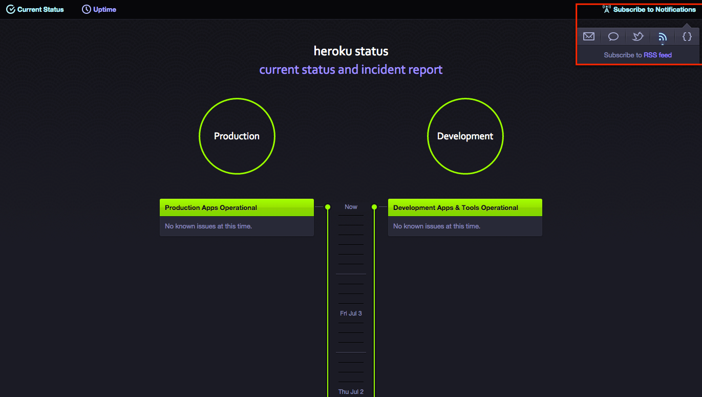
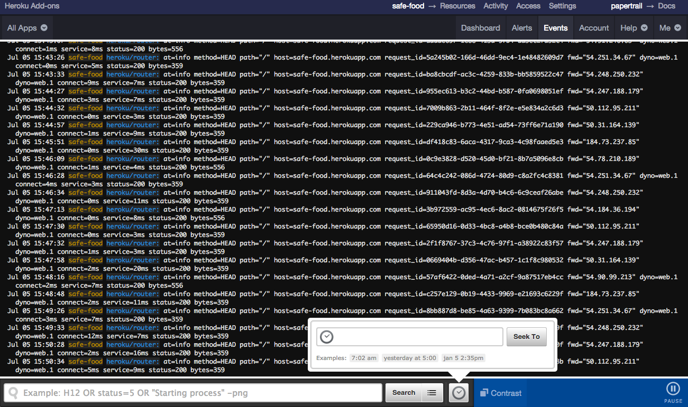
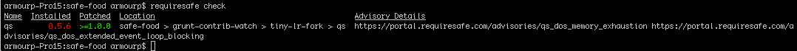
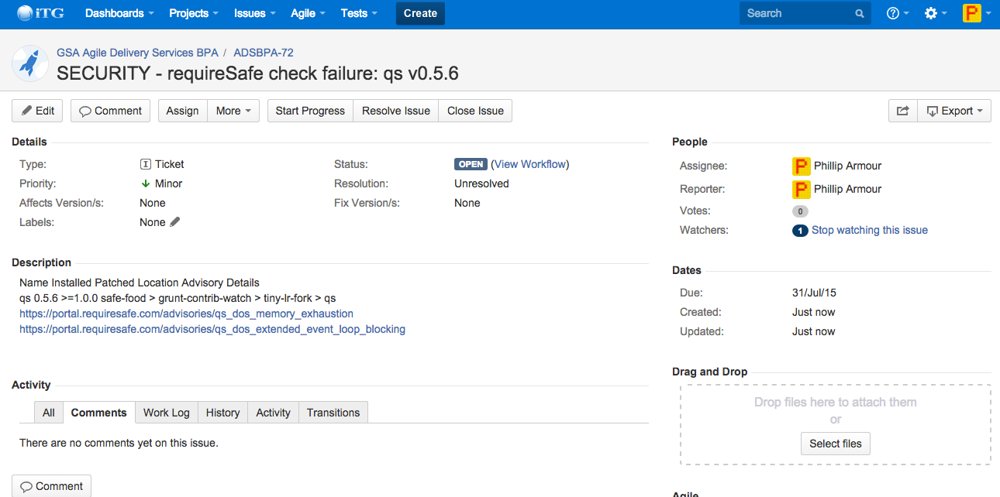

[<-- Back to the Evidence Listing](https://github.com/philarmour/staged-content/edit/master/Evidence)

***h. set up or used continuous monitoring***

**Continuous monitoring is a risk management approach to cybersecurity that maintains an accurate picture of an agency’s security risk posture, provides visibility into assets, and leverages use of automated data feeds to quantify risk, ensure effectiveness of security controls, and implement prioritized remedies. A well-designed and well-managed continuous monitoring program can effectively transform an otherwise static security control assessment and risk determination process into a dynamic process that provides essential, near real-time security status.**

## Risk Management

Risk management and cybersecurity are taken very seriously at ITG.  Given our extensive experience delivering production FISMA systems for the Federal government, we appreciate the significance in effectively performing the continuous diagnostics & mitigation (CDM) activities necessary to support security operations and compliance requirements. For this pilot we did not have scope to enact security tools in terms of security monitoring due to the integrations required, cost and complexities of some tools that can provide these kinds of monitoring.  As with all systems, the nature of the data and the integrations, as identified by the appropriate privacy or legal officer, is critical in determining the level of security requirements for a system.

## Defined Security Posture (looking at you Kent...)
-> ??

-> Is there a document we could throw together for this?

-> Some of this may be redundant from the paragraph above, but can we talk to the nature of the system not hosting any data, being pure "pass-thru", and not being an official government site (and therefore not likely as big a deal if it is defaced or DoS'd)

Since the application is currently configured for continuous deployment, it is simply an exercise in re-running the build for the application if an environment appears to be compromised. Alternatively we can "roll-back" to a previous version of the code or configurations if an error was introduced. By using github, we are ensured to have an auditable and durable source for our application's source.

## Active and Continuous Monitoring
Heroku is a PaaS built on the container concept where they can very easily keep the various parts of their stack up to date with minimal impact to the applications running on top of the stack.  To do this Heroku forces a restart of each container (dyno) at least once a day.  This process provides [Erosion Resistance] (https://devcenter.heroku.com/articles/erosion-resistance) by providing a mechnism for their engineers to push out patches and configuration updates to the OS and other key software in the Cedar-14 stack, with no actions required by application teams (i.e. their customers).  

However, for the complete system, we need to consider the security controls and how they can be implemented, monitored and executed on efficiently, to implement continuous diagnostics & mitigation (CDM).

### Inherited Controls from Heroku
The Safe Food application by virtue of being hosted by Heroku is able to inherit all of the security controls for the Heroku management applications, networking, OS, and Node.js frameworks.  Moreover, Heroku inherits the security controls from Amazon for their data centers, physical security, and several other areas. Heroku publishes a more detailed explaination of their [Security Controls](https://www.heroku.com/policy/security)

### Active Monitoring from Heroku
Beyond these controls, we as the application developers and owners are then responsible for being aware of Heroku incidents and taking recommended actions where prescribed.  We do this by being cognizant of the [Heroku Status](https://status.heroku.com) and more importantly subscribing to receive alerts about incidents.  

#### Incident RSS Feed
Our team has subscribed our Slack channel to Heroku's [incident RSS feed](https://status.heroku.com/feed) and therefore is alerted about every platform issue including security incidents. 

#### Incident Reports
In addition to the current status, the security incident reports from Heroku typically describe the issue, the steps taken by Heroku to remediate, and any actions required by the application developers.  [Here is an example](heroku_sample_incident.png). Our team has a simple protocol in place for dealing with these as they may come up:

1. Create a new Issue in JIRA and assign it to Project Architect
2. Architect reviews for impact and remediation plan
3. Architect closes or assigns ticket as appropriate

#### Log Retention and Monitoring
We utilize Papertrail to capture, store, and access all logs from our application and the Heroku hosting environment.  From these logs we can perform exploratory searches, define alerts based on saved searches, and also perform foresnic investigations after a security incident.

### Active Monitoring of Application Code and Deependencies
Additional security controls we provide are with the application code itself, including storing credentials, maintaining access controls for who can make modifications to the application. We are also response for monitoring and taking any required actions for security vulnerabilities discovered in the open source technologies that we are leveraging for our application. In addition to watching [US-CERT](https://www.us-cert.gov/ncas/alerts), we run an application called [requireSafe](https://requiresafe.com/) that scans Node modules for know vulnerabilities.

This current output shows a vulnerabilty that is not yet mitigated, however a JIRA tracking issue was created (ADSBPA-72)

## ITG's Security as a Service
Internally ITG's security team is subscribed to US-CERT among other sources, and periodically sends out action items via JIRA Issues. These actions must be reviewed and resolved by each of the project leads, ensuring vulnerabilities are known and dealt with appropriately and in a timely manner. The Safe Food application has been added to the list of projects that receive these alerts.

For other projects, ITG performs scanning of software and environments using various tools (Fortify, NESSUS, etc.) Given the current scope of the project, the technologies used and hosting environments chosen, the mentioned scans were not performed, but could be added as required by the security posture.

