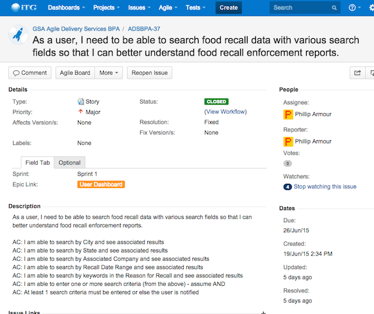

[<-- Back to the Evidence Listing](https://github.com/itgfirm/safe-food/edit/master/Evidence)  &nbsp;&nbsp;&nbsp;&nbsp;&nbsp;&nbsp;&nbsp;&nbsp;&nbsp;&nbsp;&nbsp;&nbsp;&nbsp;&nbsp;&nbsp;&nbsp;&nbsp;&nbsp;&nbsp;&nbsp;&nbsp;&nbsp;&nbsp;&nbsp;&nbsp;&nbsp;&nbsp;&nbsp;&nbsp;&nbsp;&nbsp;&nbsp;&nbsp;&nbsp;&nbsp;&nbsp;&nbsp;&nbsp;&nbsp;&nbsp;&nbsp;&nbsp;&nbsp;&nbsp;&nbsp;&nbsp;&nbsp;&nbsp;&nbsp;&nbsp;&nbsp;&nbsp;&nbsp;&nbsp;&nbsp;&nbsp;&nbsp;&nbsp;&nbsp;&nbsp;&nbsp;&nbsp;&nbsp;&nbsp;&nbsp;&nbsp;&nbsp;&nbsp;&nbsp;&nbsp;&nbsp;&nbsp;&nbsp;&nbsp;&nbsp;&nbsp;&nbsp;&nbsp;&nbsp;&nbsp;&nbsp;&nbsp;&nbsp;&nbsp;&nbsp;&nbsp;&nbsp;&nbsp;&nbsp;&nbsp;&nbsp;&nbsp;&nbsp;&nbsp;&nbsp;&nbsp;&nbsp;&nbsp;&nbsp;&nbsp;&nbsp;&nbsp;[Next Evidence (k) -->](https://github.com/itgfirm/safe-food/edit/master/Evidence/k)

***j. used an iterative approach, where feedback informed subsequent work or versions of the prototype***

ITG used an iterative approach. The sections below provide a narrative and links illustrating instances where feedback informed subsequent work of versions of our prototype. Three specific examples include:
- [New style for the application](https://github.com/itgfirm/safe-food/tree/master/Evidence/j#3---execution)
- [Modifications to fields used for search and display](https://github.com/itgfirm/safe-food/tree/master/Evidence/j#4---reflection)
- [Modified requirements for limited ability to sort via FDA's API](https://github.com/itgfirm/safe-food/tree/master/Evidence/j#5---pivot)

We also used our Continuous Deployment system to deploy updates from the team, making it immediately available for review and feedback.

# 1 - Inception
When the RFQ was published, our chosen stakeholders gathered to brainstorm ideas, and more generally come up with the idea for the application.  After developing potential ideas with some business cases and features fleshed out, they invited the technical team to discuss and provide feedback from a practical perspective. 

* The team then collaboratively worked on [mock-ups of a hypothetical application](https://github.com/itgfirm/safe-food/blob/master/Documentation/Design/wireframe_v1.pdf) to facilitate further discussion and generate a common understanding. 
* The Product Owner created [User Stories in JIRA and loaded them into the project’s backlog](https://github.com/itgfirm/safe-food/blob/master/Documentation/Process/JIRA/Screen%20Shot%202015-06-22%20at%209.20.13%20AM.png). 

# 2 - Sprint Planning
With our set of stories in the backlog, we gathered the entire team for the sprint planning session. This consisted of working with the Product Owner to prioritize the stories and better groom the backlog; It also consisted of working with the technical team to size the stories into abstract categories of complexity and effort so that the entire team could better gauge what could be accomplished during the short sprint.  

Both of these activities resulted in a very interactive conversation between the developers and the Product Owner which were documented in the [story list that could be reasonably delivered in the sprint](https://github.com/itgfirm/safe-food/blob/master/Documentation/Process/JIRA/Initial_Sprint_Stories.xlsx). 

# 3 - Execution
Once the sprint began, each day consisted of a scrum, a post-scrum discussion/follow-up, and demonstrations to the Product Owner.  We  utilized a collaboration tool called **Slack** for all communications in-between the previously mentioned events. 

[A full export of the Safe-Food Slack channel is here](https://github.com/itgfirm/safe-food/tree/master/Documentation/Process/Slack)

The **scrums** were short and collaborative where each development team member was able to report progress, plans, and issues.  

Each team member was responsible for updating the progress of their stories in JIRA: 

The **post-scrum/follow-up** was a more “in-the-weeds” conversation time, where developers asked the Product Owner and the Architect detailed questions about their stories and had constructive dialogues to clarify and design the features that he was building. 

One update that was made along the way was a [revision of the Mockup for the site](https://github.com/itgfirm/safe-food/blob/master/Documentation/Design/wireframe_v1.pdf).  It was clear the original mockup wasn't flexible enough to allow the Prodct Owner's and other stakeholders' vision for new functionality and usability come through.

The demonstrations were similar to the post-scrum/follow-up, except that they were performed when some functionality was available. This provided an opportunity to get additional feedback from the stakeholders as well as perform additional testing and debugging.  Typically our team does not perform formal demonstrations within a sprint. However, given the agressive timelines, we felt that frequent demonstrations were appropriate and necessary.

Initial demos of the site displayed a style consisting of only some basic blue color and simple layout of form fields. The feedback from the Product owner was that it wasn't very appealing and that the form for the search was very difficult to see, as well as the "Advanced" button vs. the "Search" button was not intuitive to use.

These discussion led to the creation of [new stories](https://github.com/itgfirm/safe-food/blob/master/Documentation/Process/JIRA/Initial_Sprint_Stories.xlsx) around adding better style for the site, including the navigation as well as the colors and the creation of a logo. These stories were added to the backlog as they came up (as opposed to being added to the ongoing sprint.)

By the end of the Sprint, the final style of the application was quite different to the delight of the Product Owner:

# 4 - Reflection
There were many points of reflection in our project resulting from technical clarifications on the API, demonstrations, as well as extensions provided by GSA.  Our team was able to openly discuss the issues and opportunities at each reflection point including the Product Manager, Scrum Master and the development team. In many cases our team only needed to agree to modify the story objectives or acceptance criteria for the sprint story to align with the evolving understanding of the requirement. 

An example of this included revising the search fields.  The story went through several revisions after the inital requirement:

From there a [more detailed analysis and spec](https://github.com/itgfirm/safe-food/blob/master/Documentation/Design/ViewEntries_Design.docx) was devised.  And the resulting functionality is now much simpler, intuitive, and satisfies the intended requirements of the Product Owner:

However in other cases, we needed to discussed the impacts of changing the scope of the sprint (typically by removing specific stories from the sprint when they became obsolete or overly complicated in favor of new or revised stories that more fully implemented the Product Owner's vision.

In fact when we were informed of the first deadline extension we performed a small sprint planning session in which we allowed the Sprint to be extended and therefore the capacity to increase.  The Product Owner then worked with the team to select the desired additional stories that she felt would best improve the application.  These included the style stories as well as some additional stories we had ear-marked as "stretch" stories from before - such as using location services to automatically lookup recalls for the current user.

As the following shows, there was an increase in scope half-way through the project:

# 5 - Pivot
From each Reflection Point, our team needed to pivot and be agile in our work.  During the tight collaboration required to modify stories and acceptance criteria, the developers discussed limitations and new ideas with the product owner, designer, and other proxy stakeholders.  The result was new implementations, new test cases, revised agile stories.  This level of accountability and transparency allowed the pivots to happen seamlessly throughout the project.

One such example of this, was in our User Story for [sorting search results (ADSBPA-47)](https://github.com/itgfirm/safe-food/blob/master/Documentation/Process/JIRA/Final_Sprint_Stories.xlsx).  

In that Story, the user wanted the ability to sort the search results by any of the fields returned.  Initial this seemed reasonable, however after becoming more familiar with the FDA Open Data API, it became clear that sorting wasn't supported by their API and the API limits the returned results to pages no larger than 100 records, so pulling all of the records to allow the user to sort them in the UI did not seem practical.

However after some investigation, one of our developers came up with a way to efficiently query the counts of ranges of records to effectively sort the results by a date field (namely the date the recall was initiated).  This method allows the records in the search results to display in chronological order (newest at the top), which was the major motivation of the Product Owner in asking for search in the first place.  This compromise allowed the Product Owner to get the needed functionality, but it also allowed the technical team to work within the confines of the technologies to deliverable working and practical solutions.

# 6 - Release & Retrospection
Upon completion of development and testing, ITG stabilized the code and deployment process to best represent a “production” environment. We also conducted a sprint retrospective with the development team and the Product Owner where we reviewed the effectiveness of our product and process. Each developer was able to express their thoughts and contribute ideas for future improvements. The Product Owner was also able to provide her perspective and similarly identify successes and suggest improvements.

[<-- Back to the Evidence Listing](https://github.com/itgfirm/safe-food/edit/master/Evidence)  &nbsp;&nbsp;&nbsp;&nbsp;&nbsp;&nbsp;&nbsp;&nbsp;&nbsp;&nbsp;&nbsp;&nbsp;&nbsp;&nbsp;&nbsp;&nbsp;&nbsp;&nbsp;&nbsp;&nbsp;&nbsp;&nbsp;&nbsp;&nbsp;&nbsp;&nbsp;&nbsp;&nbsp;&nbsp;&nbsp;&nbsp;&nbsp;&nbsp;&nbsp;&nbsp;&nbsp;&nbsp;&nbsp;&nbsp;&nbsp;&nbsp;&nbsp;&nbsp;&nbsp;&nbsp;&nbsp;&nbsp;&nbsp;&nbsp;&nbsp;&nbsp;&nbsp;&nbsp;&nbsp;&nbsp;&nbsp;&nbsp;&nbsp;&nbsp;&nbsp;&nbsp;&nbsp;&nbsp;&nbsp;&nbsp;&nbsp;&nbsp;&nbsp;&nbsp;&nbsp;&nbsp;&nbsp;&nbsp;&nbsp;&nbsp;&nbsp;&nbsp;&nbsp;&nbsp;&nbsp;&nbsp;&nbsp;&nbsp;&nbsp;&nbsp;&nbsp;&nbsp;&nbsp;&nbsp;&nbsp;&nbsp;&nbsp;&nbsp;&nbsp;&nbsp;&nbsp;&nbsp;&nbsp;&nbsp;&nbsp;&nbsp;&nbsp;[Next Evidence (k) -->](https://github.com/itgfirm/safe-food/edit/master/Evidence/k)
